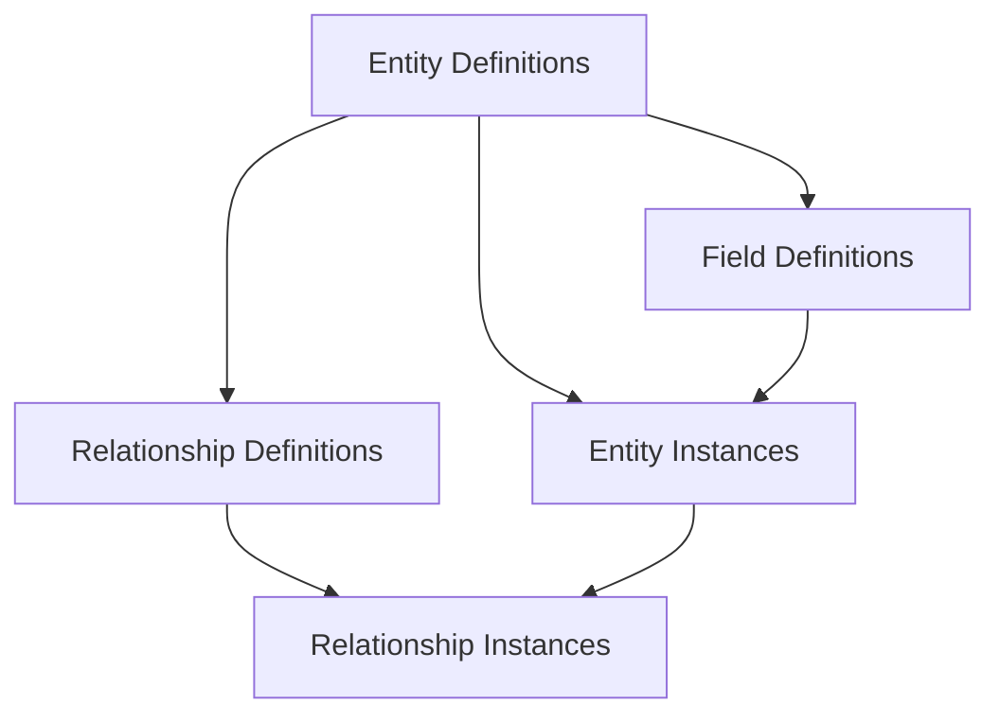

# System Customization

HAER's architecture is built on a **Metadata-Driven Layer** that powers all customization capabilities. Rather than modifying database schemas or writing code, administrators define structures through APIs that the platform interprets at runtime. This approach enables organizations to extend the system to meet unique requirements without deployments or migrations.

::callout{type="info"}
**Key Principle**: All customizations are stored as metadata and interpreted dynamically, ensuring the core system remains stable while supporting unlimited flexibility.
::

---

## Architecture Overview

The customization system consists of four interconnected components:



| Component                   | Purpose                                           | Database Table             |
| --------------------------- | ------------------------------------------------- | -------------------------- |
| **Entity Definition**       | Defines the structure (like a "table schema")     | `entity_definitions`       |
| **Field Definition**        | Defines attributes for an entity (like "columns") | `field_definitions`        |
| **Entity Instance**         | Stores actual data records (like "rows")          | `entity_instances`         |
| **Relationship Definition** | Defines how entities relate to each other         | `relationship_definitions` |
| **Relationship Instance**   | Stores actual relationship links                  | `relationship_instances`   |

---

## 1. Entity Definitions

Entity Definitions act as the blueprint for your data structures. HAER distinguishes between **Core Entities** (pre-defined by the system) and **Custom Entities** (created by tenants).

### Core Entity Registry

HAER comes with a comprehensive registry of pre-registered core entities that support customization out of the box:

::tabs
::tab{label="Organization Structure"}
| Entity Code | Name | Table |
|-------------|------|-------|
| `L1Organization` | L1 Organization | `l1_organizations` |
| `L2Organization` | L2 Organization | `l2_organizations` |
| `L3Organization` | L3 Organization | `l3_organizations` |
| `L4Organization` | L4 Organization | `l4_organizations` |
| `L5Organization` | L5 Organization | `l5_organizations` |
::

::tab{label="Job Structure"}
| Entity Code | Name | Table |
|-------------|------|-------|
| `J1` | J1 Job Family | `j1` |
| `J2` | J2 Job Role | `j2` |
| `J3` | J3 Job Profile | `j3` |
| `J4` | J4 Job Code | `j4` |
| `JobProfile` | Job Profile | `job_profiles` |
| `JobLevel` | Job Level | `job_levels` |
| `JobGrade` | Job Grade | `job_grades` |
::

::tab{label="People & Position"}
| Entity Code | Name | Table |
|-------------|------|-------|
| `Person` | Person | `persons` |
| `Position` | Position | `positions` |
| `PersonDetails` | Person Details | `person_details` |
| `ContactInformation` | Contact Information | `contact_information` |
| `Family` | Family | `family` |
| `EmploymentTerms` | Employment Terms | `employment_details` |
| `JobAssignment` | Job Assignment | `job_assignments` |
::

::tab{label="Competencies"}
| Entity Code | Name | Table |
|-------------|------|-------|
| `Competency` | Competency | `competencies` |
| `CompetencyScale` | Competency Scale | `competency_scales` |
| `CompetencyScaleLevel` | Scale Level | `competency_scale_levels` |
| `PersonCompetencyProficiency` | Person Proficiency | `person_competency_proficiencies` |
::

::tab{label="Time Management"}
| Entity Code | Name | Table |
|-------------|------|-------|
| `DailyWorkSchedule` | Daily Work Schedule | `daily_work_schedules` |
| `PeriodWorkSchedule` | Period Work Schedule | `period_work_schedules` |
| `HolidayCalendar` | Holiday Calendar | `holiday_calendars` |
| `WorkScheduleRule` | Work Schedule Rule | `work_schedule_rules` |
| `EmployeeTimeProfile` | Employee Time Profile | `employee_time_profiles` |
::
::

### Creating Custom Entities

To create a custom entity, use the `/api/customization/entities` endpoint:

```json
POST /api/customization/entities
{
  "entity_code": "TrainingCourse",
  "entity_name": "Training Course",
  "description": "Custom entity for tracking employee training courses"
}
```

### Entity Definition Properties

| Property                 | Type    | Description                                     |
| ------------------------ | ------- | ----------------------------------------------- |
| `entity_code`            | String  | Unique identifier (e.g., `TrainingCourse`)      |
| `name`                   | String  | Display name                                    |
| `description`            | String  | Optional description                            |
| `entity_type`            | Enum    | `core` or `custom`                              |
| `entity_category`        | Enum    | `foundational`, `operational`, `transactional`  |
| `is_effective_dated`     | Boolean | Whether the entity supports temporal versioning |
| `supports_relationships` | Boolean | Whether relationships can be defined            |
| `supports_history`       | Boolean | Whether change history is tracked               |
| `code_prefix`            | String  | Prefix for auto-generated codes (e.g., `TRN_`)  |

---

## 2. Field Definitions

Field Definitions describe the attributes available on an entity. Every field has a type, validation rules, and optional constraints.

### Supported Field Types

| Type        | Description            | Example Use Case             |
| ----------- | ---------------------- | ---------------------------- |
| `text`      | Single-line text input | Employee ID, Short names     |
| `textarea`  | Multi-line text        | Descriptions, Notes          |
| `number`    | Numeric values         | Salary, FTE percentage       |
| `date`      | Date picker            | Birth date, Hire date        |
| `boolean`   | True/False toggle      | Is Active, Is Manager        |
| `select`    | Dropdown selection     | Status, Category             |
| `reference` | Link to another entity | Parent Organization, Manager |
| `json`      | Structured JSON data   | Complex configurations       |

### Field Definition Properties

```json
POST /api/customization/fields
{
  "entity_id": "uuid-of-training-course-entity",
  "field_name": "duration_hours",
  "display_name": "Duration (Hours)",
  "field_type": "number",
  "is_required": true,
  "validation": {
    "min": 1,
    "max": 1000
  }
}
```

| Property                | Type    | Description                                            |
| ----------------------- | ------- | ------------------------------------------------------ |
| `field_code`            | String  | Unique identifier within the entity                    |
| `field_label`           | String  | Display label                                          |
| `data_type`             | Enum    | `string`, `number`, `date`, `boolean`, `json`, `array` |
| `field_type`            | Enum    | UI control type (`text`, `textarea`, `select`, etc.)   |
| `is_required`           | Boolean | Whether the field must have a value                    |
| `is_unique`             | Boolean | Whether values must be unique                          |
| `max_length`            | Number  | Maximum string length                                  |
| `precision` / `scale`   | Number  | For decimal numbers                                    |
| `default_value`         | String  | Default value when creating records                    |
| `reference_entity_code` | String  | For reference fields, the target entity                |
| `reference_field`       | String  | The field to display from referenced entity            |

### Reference Fields

Reference fields create links between entities. For example, a Position can reference Organizations at multiple levels:

```typescript
{
  fieldCode: 'l1Code',
  fieldLabel: 'L1 Organization',
  fieldType: 'reference',
  dataType: 'string',
  referenceEntityCode: 'L1Organization',
  referenceField: 'code'
}
```

---

## 3. Entity Instances

Entity Instances are the actual data records stored against an entity definition. They contain the field values and support temporal versioning.

### Creating Records

```json
POST /api/customization/entities/{entityId}/records
{
  "workspace_id": "workspace-uuid",
  "values": [
    { "attribute_id": "field-uuid-1", "value": "Advanced Excel Training" },
    { "attribute_id": "field-uuid-2", "value": "8" }
  ]
}
```

### Instance Properties

| Property                  | Type     | Description                                    |
| ------------------------- | -------- | ---------------------------------------------- |
| `record_code`             | String   | Business identifier (auto-generated or manual) |
| `record_name`             | String   | Display name                                   |
| `field_values`            | JSON     | Key-value pairs of field data                  |
| `version`                 | Number   | Version number for SCD2                        |
| `valid_from` / `valid_to` | DateTime | Temporal validity period                       |
| `is_current`              | Boolean  | Whether this is the current version            |
| `is_active`               | Boolean  | Soft-delete flag                               |

### Filtering & Querying

Entity instances support advanced filtering:

```
GET /api/customization/entities/{entityId}/records
  ?search=Excel
  &page=1
  &limit=20
  &sort_by=created_at
  &sort_order=DESC
```

Filters support multiple operators:

| Operator                  | Description             |
| ------------------------- | ----------------------- |
| `eq`                      | Equals                  |
| `ne`                      | Not equals              |
| `gt` / `gte`              | Greater than (or equal) |
| `lt` / `lte`              | Less than (or equal)    |
| `contains`                | String contains         |
| `startsWith` / `endsWith` | String matching         |
| `in` / `notIn`            | Array membership        |

---

## 4. Relationships

The Relationship Engine allows you to define how different entities interact, with full support for cardinality and referential integrity.

### Relationship Types

| Type           | Description                             | Example                  |
| -------------- | --------------------------------------- | ------------------------ |
| `one_to_one`   | Single record links to single record    | Person → User Account    |
| `one_to_many`  | Single record links to multiple records | Department → Employees   |
| `many_to_one`  | Multiple records link to single record  | Positions → Organization |
| `many_to_many` | Multiple records on both sides          | Employees ↔ Projects     |

### Creating Relationships

```json
POST /api/customization/entity-relationships
{
  "workspace_id": "workspace-uuid",
  "from_entity_id": "uuid-of-department",
  "to_entity_id": "uuid-of-asset",
  "relationship_name": "dept_assets",
  "relationship_display_name": "Department Assets",
  "relationship_type": "one_to_many",
  "from_cardinality": "single",
  "to_cardinality": "multiple",
  "on_delete_referential_action": "SET_NULL",
  "is_bidirectional": true
}
```

### Referential Actions

| Action      | Behavior                                        |
| ----------- | ----------------------------------------------- |
| `CASCADE`   | Delete related records when parent is deleted   |
| `SET_NULL`  | Clear the relationship but keep related records |
| `RESTRICT`  | Prevent deletion if related records exist       |
| `NO_ACTION` | No automatic action (application must handle)   |

---

## 5. The Customization Facade

The `CustomizationFacadeService` provides a unified API for consuming custom data alongside core entity data. This is the primary integration point for applications.

### Key Operations

| Method                   | Purpose                                             |
| ------------------------ | --------------------------------------------------- |
| `getFieldDefinitions()`  | Retrieve all custom field definitions for an entity |
| `getValuesForEntities()` | Get custom field values for multiple entity records |
| `mergeCoreWithCustom()`  | Combine core entity data with custom field values   |
| `bulkSetValidated()`     | Atomically update multiple custom field values      |

### Response Formats

When querying entities with `include=custom`, you can specify the format:

::tabs
::tab{label="Block Format (Default)"}

```json
{
  "id": "uuid",
  "code": "ORG001",
  "name": "Engineering",
  "custom": {
    "fields": [
      {
        "fieldName": "costCenter",
        "displayName": "Cost Center",
        "fieldType": "text"
      }
    ],
    "values": {
      "costCenter": "CC-1001"
    }
  }
}
```

Ideal for frontend rendering where you need field metadata.
::

::tab{label="Flat Format"}

```json
{
  "id": "uuid",
  "code": "ORG001",
  "name": "Engineering",
  "custom.costCenter": "CC-1001"
}
```

Ideal for data exports, reports, and flat data processing.
::
::

### Usage in Services

```typescript
// In your service
const customMap = await this.customizationFacade.getValuesForEntities(
  "L1Organization",
  organizationCodes,
  tenantId
);

const defs = await this.customizationFacade.getFieldDefinitions(
  "L1Organization",
  tenantId
);

const enrichedData = this.customizationFacade.mergeCoreWithCustom(
  coreOrganizations,
  customMap,
  defs,
  "L1Organization",
  { format: "block" }
);
```

---

## 6. Temporal Support

Custom entities and attributes fully integrate with HAER's [Effective Dating](/concepts/effective-dating) system.

### Temporal Records

Custom entity instances support versioning with `valid_from` and `valid_to` dates:

```json
POST /api/customization/temporal-records
{
  "entity_id": "uuid",
  "workspace_id": "workspace-uuid",
  "record_name": "Training Policy v2",
  "field_values": { "policy_text": "Updated policy..." },
  "effective_date": "2024-01-01"
}
```

### Temporal Validation

Before creating or updating temporal records, you can validate that the proposed dates don't conflict:

```json
POST /api/customization/validate-temporal
{
  "entity_id": "uuid",
  "workspace_id": "workspace-uuid",
  "record_code": "POL001",
  "effective_date": "2024-01-01"
}
```

### Temporal Attributes

Individual field values can also be time-dependent:

```json
POST /api/customization/validate-attribute-temporal
{
  "entity_id": "uuid",
  "attribute_id": "field-uuid",
  "value": "New Value",
  "effective_date": "2024-01-15"
}
```

---

## 7. Core Entity Extensions

You can extend **any core entity** with custom fields without modifying the underlying database schema.

### How It Works

1. The system registers core entities in the `CoreEntityRegistry`
2. Each core entity has pre-defined fields in the `CoreFieldRegistry`
3. You can add custom fields that are stored in `entity_instances`
4. The Customization Facade merges core data with custom data at query time

### Adding Custom Fields to Core Entities

```json
POST /api/customization/fields
{
  "entity_id": "uuid-of-L1Organization-entity-definition",
  "field_name": "regional_manager_email",
  "display_name": "Regional Manager Email",
  "field_type": "text",
  "validation": {
    "pattern": "^[a-zA-Z0-9._%+-]+@[a-zA-Z0-9.-]+\\.[a-zA-Z]{2,}$"
  }
}
```

### Setting Custom Values on Core Records

```json
POST /api/customization/bulk-set-validated
{
  "entity_name": "L1Organization",
  "entity_id": "ORG001",  // The business code of the organization
  "values": [
    { "attribute_id": "field-uuid", "value": "regional.manager@company.com" }
  ]
}
```

---

## 8. Security & Multi-Tenancy

Every component of the customization system is strictly isolated:

| Scope                     | Description                                                 |
| ------------------------- | ----------------------------------------------------------- |
| **Tenant Isolation**      | All definitions and instances are filtered by `tenant_id`   |
| **Workspace Scoping**     | Optionally restrict visibility to specific workspaces       |
| **Record-Level Security** | Custom field access follows the parent entity's permissions |

### Workspace-Level Fields

Fields can be defined at:

- **Tenant Level** (`workspace_id = null`): Available across all workspaces
- **Workspace Level** (`workspace_id = <uuid>`): Only visible within that workspace

```json
{
  "entity_id": "uuid",
  "field_name": "local_policy",
  "display_name": "Local Policy Reference",
  "workspace_id": "workspace-uuid" // Workspace-specific field
}
```

---

## API Reference

### Entities

| Method | Endpoint                      | Description          |
| ------ | ----------------------------- | -------------------- |
| `POST` | `/api/customization/entities` | Create custom entity |
| `GET`  | `/api/customization/entities` | List custom entities |

### Fields

| Method | Endpoint                                           | Description                 |
| ------ | -------------------------------------------------- | --------------------------- |
| `POST` | `/api/customization/fields`                        | Add field to entity         |
| `GET`  | `/api/customization/attributes`                    | List fields for entity type |
| `PUT`  | `/api/customization/attributes/:fieldId`           | Update field                |
| `POST` | `/api/customization/attributes/:fieldId/duplicate` | Duplicate field             |

### Records

| Method | Endpoint                                                         | Description   |
| ------ | ---------------------------------------------------------------- | ------------- |
| `POST` | `/api/customization/entities/:entityId/records`                  | Create record |
| `GET`  | `/api/customization/entities/:entityId/records`                  | List records  |
| `GET`  | `/api/customization/entities/:entityId/records/:recordId`        | Get record    |
| `POST` | `/api/customization/entities/:entityId/records/:recordId/values` | Set values    |

### Relationships

| Method   | Endpoint                                      | Description         |
| -------- | --------------------------------------------- | ------------------- |
| `POST`   | `/api/customization/entity-relationships`     | Create relationship |
| `GET`    | `/api/customization/entity-relationships`     | List relationships  |
| `PUT`    | `/api/customization/entity-relationships/:id` | Update relationship |
| `DELETE` | `/api/customization/entity-relationships/:id` | Delete relationship |

### Bulk Operations

| Method | Endpoint                                | Description                  |
| ------ | --------------------------------------- | ---------------------------- |
| `POST` | `/api/customization/bulk-set-validated` | Bulk update custom values    |
| `GET`  | `/api/customization/record-counts`      | Get record counts per entity |

---

## Best Practices

::callout{type="tip"}
**Naming Conventions**: Use `snake_case` for field codes and entity codes to maintain consistency with the API.
::

1. **Plan Your Schema**: Before creating custom entities, map out relationships and required fields
2. **Use References**: Link related data through reference fields rather than duplicating data
3. **Leverage Temporal Features**: Enable effective dating for entities that need historical tracking
4. **Validate Early**: Use temporal validation endpoints before creating records
5. **Batch Operations**: Use bulk endpoints for large-scale data updates
6. **Cache Definitions**: Field definitions rarely change; cache them on the client side
